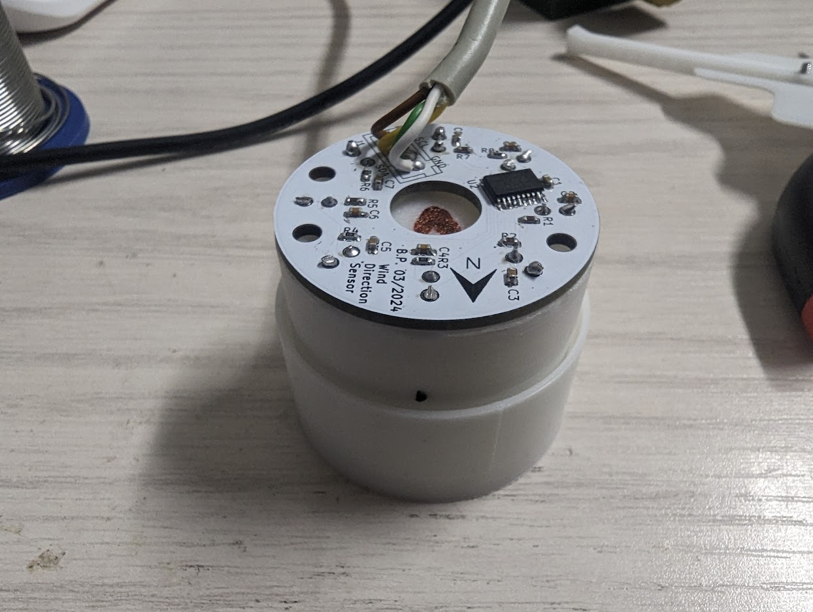

# LoRa Weather Station

The project was born for testing LoRa devices an has grown to a small weather station ecosystem.
Since August 2002, there are 6 station outside running without any maintenance. 

## Features

 - Completely 3D printed main body
 - Modular with optional extension
 - Simple PCB which can be hand assembled
 - Stations can be equipped with sensors as needed, they don't have to be the same kind
 - Using TheThingsStack for receiving data
 - Storage and analysis of data using a PHP framework (other repository)

## Housing

The main housing consists of:
 - Main housing
 - Front door
 - Sensor cover **or** light sensor mount
 - 2x side dust filter fixture
 - Front door dust filter fixture

On the sides and in the front door, there is the possibility to mount some 3mm fleece filters to prevent dust going into the housing and keep bugs out. A disadvantage is, that the inside gets a bit hotter if exposed to the sun.
The best mounting position of the station is 2m from the ground facing north and protected from sun exposure (The solar cell will get enough light to charge the battery).
A 80x55mm 7V solar cell is used to charge the battery. The solar cell is glued to the main body using silicone glue. This works great to keep rain out,
On the bottom is a intended breaking point to mount 12mm screw connectors for external sensors e.g. rain sensor or wind direction sensor.
On the left side is a hole for mounting a SMA connector for the LoRa antenna.
The housing can be mounted on a wall using a hook or screw.

## PCB
The PCB is kept simple, so it can be assembled by hand. It has to be screwed into the main body using **M3x8** (or similar length, there is plenty of space for longer screws)

It is possible to use it just as carrier board, in this case, no component needs to be assembled.
For easier installation, XH connectors are used to connect sensors, battery, solar cell etc.
The CubeCell AB01 board is the brain of the weather station. It has a battery connector on its bottom side. For easier replacement of board or battery, this connector is connected with the PCB which again connects to the battery.
A BME280 board is connected using a standard header, so it can be replaced easily.

Two holes on the lower side of the PCB are for mounting a lithium battery using zip ties.
A  standard 1000mA 3.7V LIPO battery works great and never ran out even on cold and dark winter weeks.

## Wind Direction Sensor

The wind direction sensor uses 8 reed contacts, a I2C port expander, a bearing (**608ZZ**) and a paddle to read the wind direction.

Only the expander and some few components need to be assembled.

The reed contacts are pushed through the sensor main body, On the upper side, a short wire has to be soldered to the reed contact and threaded through the second hole. The sensor and wire are then soldered to the sensor PCB.
A ⌀6x3mm magnet is glued into the sensor pin.

## Wind Speed Sensor

The wind speed sensor using the same style bearing and manget like the direction sensor. It only consists of one reed contact. 
This sensor is an early alpha state, because the baring is to difficult to move and won't turn on low wind speeds. Maybe switching to a off-the-shelf product for this use case.

## Rain sensor

The 3D printed version of a rain sensor was not reliable enough. A cheap off the shelf sensor which is sold as spare part for weather stations works well. 

## Light sensor

A VEML7700 can be mounted on the side of the main body. For this print the mount and install the sensor within the mount. Fill up the space with transparent silicone. It will get watertight and works well. 

# Firmware
The firmware is made using PlatformIO and the Heltec development platform.
Simply open with VSCode and edit the platform.ini
You can change following build flags:

- ENABLE_RAINSENSOR=0 ; enables the rain drip sensor
- ENABLE_BRIGHTNESSENSOR=1 ; enables the brightness sensor
- ENABLE_WINDDIRSENSOR=0 ; enables the wind direction sensor
- ENABLE_WINDSPEEDSENSOR=0 ; enables the winds speed sensor
- DEBUG_UART=0  ; enables UART data sending for debug purposes

Enable the functionalities as wanted. 

>  Wind speed and direction are BETA!

As brightness sensor the VEML7700 is used. The BH1750 was also tested, but the results with this sensor were not really great. It was not really possible to get the cheap housing with the light dome watertight and several sensors died after a few days. If you want to use the BH1750, some changes in the code are necessary since this parts were removed.

Then hook up with TheThingsStack. There add a new device and get the neccessary data for OTAA transmission. Insert the information in the src/ttnparams.h file.

You probably will need a payload formatter for each individual weather station, since not all stations must have the same functionallity.

Here is a example formatter:

    function Decoder(bytes, port) {
    var temperature = (bytes[0] << 8 | bytes[1]);
	var humidity = (bytes[2] << 8 | bytes[3]);
    var pressure = ((bytes[4]) << 24) + ((bytes[5]) <<  16) + ((bytes[6]) << 8) + ((bytes[7]));
    var battery = (bytes[8] << 8) | bytes[9];
    var unused = (bytes[10] << 8) | bytes[11]; // formally used for battery percent calculation
    var brightness = (bytes[12] << 8) | bytes[13];
    var rain = bytes[14];
  
    var lux = brightness * 2.1504; // Datasheet: Gain 1/8, 25ms integration time
    lux = Math.round(6.0135e-13 * Math.pow(lux, 4) - 9.3924e-9 * Math.pow(lux, 3) + 8.1488e-5 * Math.pow(lux, 2) + 1.0023 * lux);
 
    var sensorSqure = 10.9 * 4.9; // for round rain sensors: sensorSqure = Math.PI * pow(sensorRadius, 2);
    var tipsPer100ml = 100 / 1.5;
    var mlPerTip = 100 / $tipsPer100ml;
    var rainAmount = $mlPerTip / $sensorSqure;
  
    return {
      temperature: temperature / 100,
      humidity: humidity,
      pressure: pressure / 100,
      battery: battery / 1000,
      brightness: lux,
      rain: rainAmount
      }
    }

If a station doesnt have a specific feature, just remove it from the return. The value has to be null to indicate, that the sensor is not available.

Example formatter for the most basic station just with a BME280:

    function Decoder(bytes, port) {
    var temperature = (bytes[0] << 8 | bytes[1]);
	var humidity = (bytes[2] << 8 | bytes[3]);
    var pressure = ((bytes[4]) << 24) + ((bytes[5]) <<  16) + ((bytes[6]) << 8) + ((bytes[7]));
    var battery = (bytes[8] << 8) | bytes[9];
    var unused = (bytes[10] << 8) | bytes[11]; // formally used for battery percent calculation

    return {
      temperature: temperature / 100,
      humidity: humidity,
      pressure: pressure / 100,
      battery: battery / 1000,
      }
    }